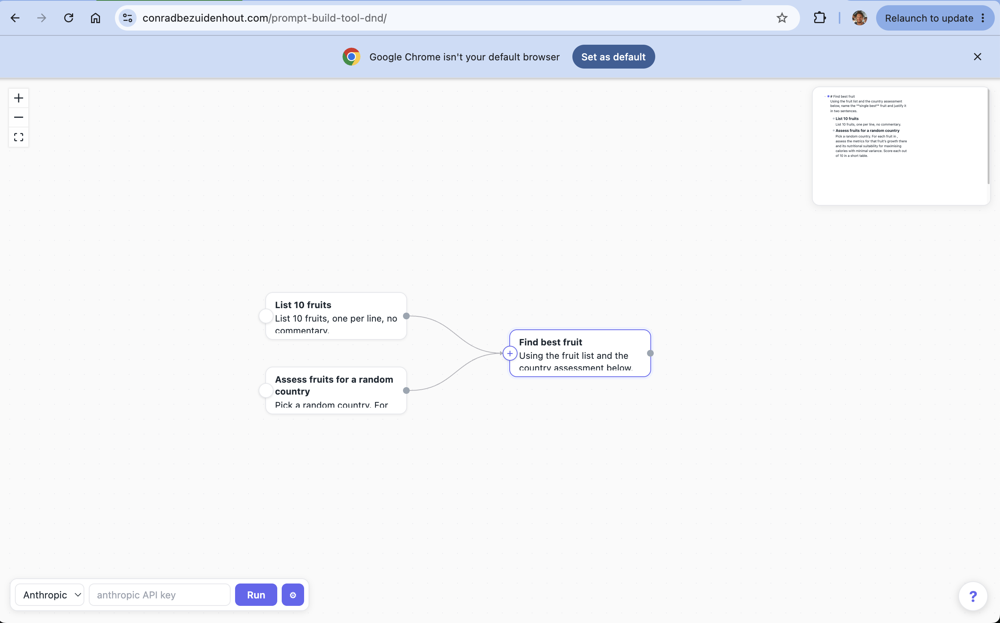
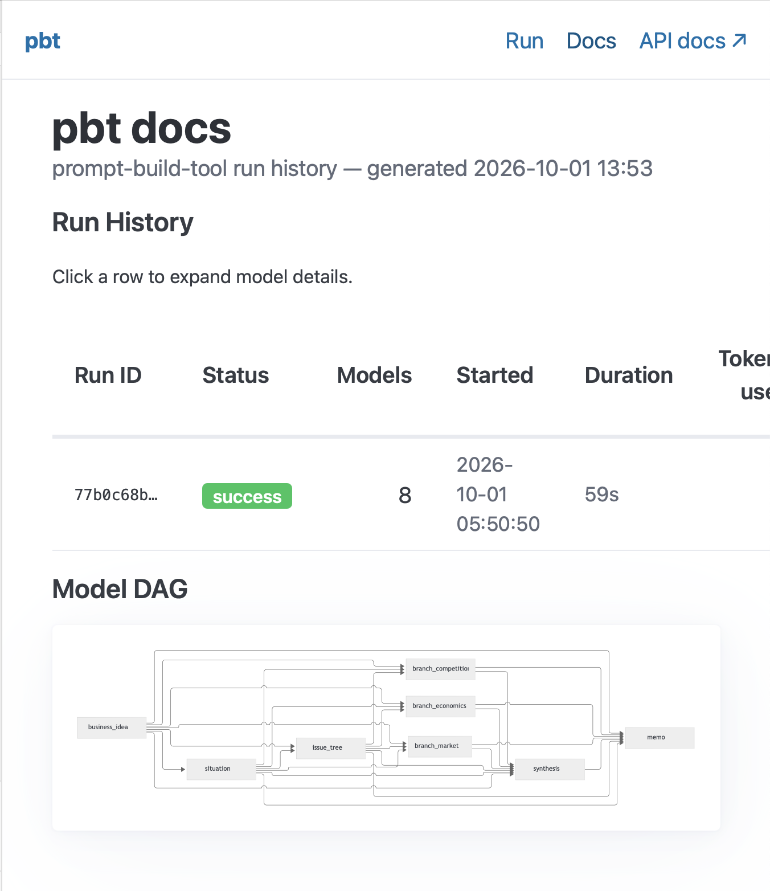

At the edge of digital revolution, at the edge of industrial revolution and today we are asking, what do humans do? First it's important to ask what don't LLMs do.

I'm betting that humans have an intuition that LLMs don't, somthing best ilustrated through how I made a mistake I could imagine an LLM making, and showing how to fix this mistake.

# Updating the map - tests

My Large Language Model is a drunken tourist in Dublin.

We understnad we need to work off a map, and we need to validate our map's effectiveness against the real world. We need to check our understanding against reality and we natuary structure this as (1) have an feeling (2) test the feeling against the real world (3) update the feeling. I think this is well illustrated through where this intuitive loop failed me.

On a trip through Dublin,a friend and I were walking back from a pub after a few pints, talking. I had Google Maps on and was laser focussed on following the map in a strange city knowing I'm tipsy. To my horror, after 30min of walking my friend asks "isn't this the pub we came from".  In part due to conversation, in part due to the beers, I had turned around and started following the gray "this is where you have walked" part of the map. I wished I had the common sense to check my suroundings against the map instead of blindly following the outlined path to follow. Similarly, I think when people develop software, they should be thinking about "landmarks", "directionality" and "smoke tests" to test direction and accuracy along the way. And LLM's too.

So what does the "intuition" loop that allows us to update our mental map look like? Well in the map example above we might asks ourselves periodically, "I feel like I'm walking theright way", "let me check the river on the map and look up to see if I can see the river", "there is no river - now I feel uncertain".

These checks only help if you make a prediction first. "I expect to see the river on my left" is a test of your intuition.

`pbt tests` is a strutured way for us humans to look up and spot the landmarks as the LLM is following our map of models. They should be there to test what we expect to get out, making sure the map's intuition still holds against the real world.

# Creating the maps

`pbt models` on the other hand is the map that holds the destination and divergent road leading to the destination. `pbt` tries to give your mental map of the problem a natural resting place, much like a paper map helps build up a picture in your head of streets to come and gives you landmarks to oriente yourself against the real world. 

A fitting analogy is how in physics I was told never to erase incorrect working, but rather build off it and using it to navigate closer to the correct answer. If we treat each propt as reaching a single goal and treat it as a pass fail we lose the contextual journey and struggle to orientate ourselves to the destination. At the same time if we mindlessly save every prompt we end in chaoss, something akin to trying to use "101 sights to see in Dublin" to navigate the streets.

This is perhaps best illustrated through the drag-and-drop companion to `pbt`:

Each model should be a hypothesis, connected to higher and lower order hypothesis, forming a map of the problem at hand. To adjust a outcome one might need to test an adjustment at a lower lever, or account for a drift in underlying assumptions but should *never* involve one-shot rewrite. Teaking to fit the map to the intuitive sense in *our* heads is in my opinion the secret sauce to unlocking LLM productivity.

